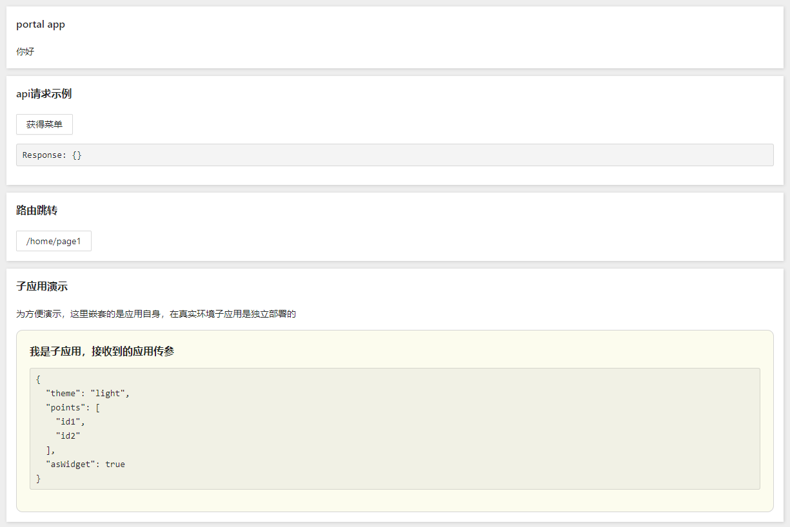

## 脚手架

先找个地方建个空目录。

```shell
$ mkdir myapp && cd myapp
```

通过官方工具创建项目，

```shell
yarn create portal-app
# 或 npx create-portal-app

Copy:  .editorconfig
Copy:  .env
Copy:  .npmignore
Copy:  .prettierignore
Copy:  .prettierrc
Copy:  config/config.local.ts
Copy:  config/config.ts
Copy:  config/portal.ts
Copy:  config/proxy.ts
```

## 安装依赖

```shell
yarn
```

## 启动项目

```shell
$ yarn start

yarn run v1.22.4
warning package.json: No license field
$ umi dev
INFO umi portal plugin.
Bundle with webpack 5...
Starting the development server...
```

在浏览器里打开 [http://localhost:3100/](http://localhost:3100/)，能看到以下界面，



## 构建

```bash
$ yarn build

✔ Webpack
  Compiled successfully in 17.17s

 DONE  Compiled successfully in 17167ms                                       8:26:25 PM

Build success.
✨  Done in 20.79s.
```

构建产物默认生成到 `./dist` 下，然后通过 tree 命令查看，

```bash
tree ./dist

./dist
├── index.html
├── umi.css
└── umi.js
```
