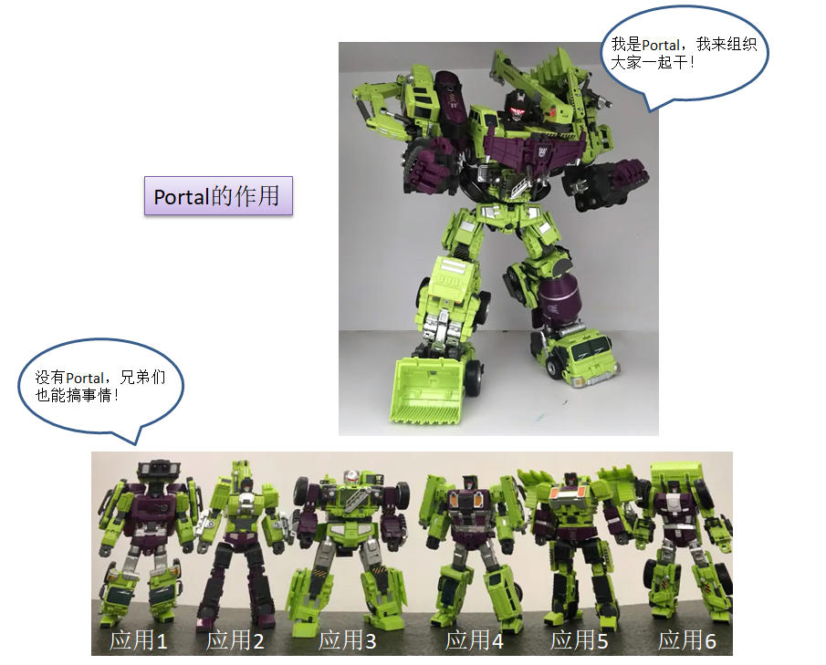

## k2-portal 是什么

组织、协调众多应用的微前端框架。入门门槛低，懂 Umi 就能开发，其它的事情通过配置解决。

## k2-portal 做了什么

- 提供应用生成器，用来生成应用模板
- 框架功能配置化
- 提供登录退出钩子
- 基于 BCF，提供常用的业务功能函数
- 无刷新风格切换
- 共享数据收集转发

## k2-portal 希望你做的事情

把代码写好，多注释，少打 log，遵循应用服务化思维，做好技术沉淀。

笑迎后来人：“我曾苦过你的甜”。
